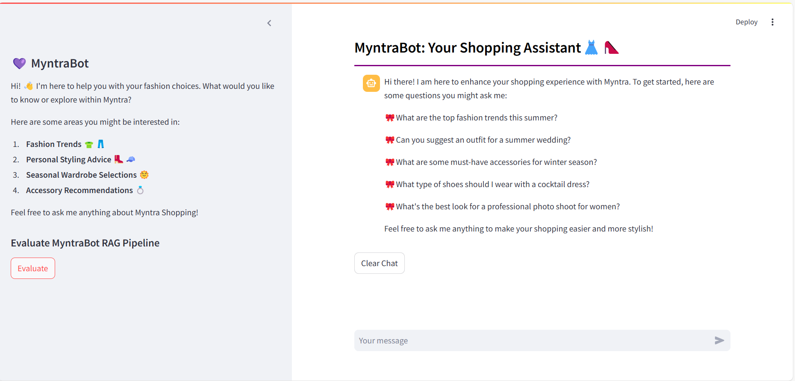
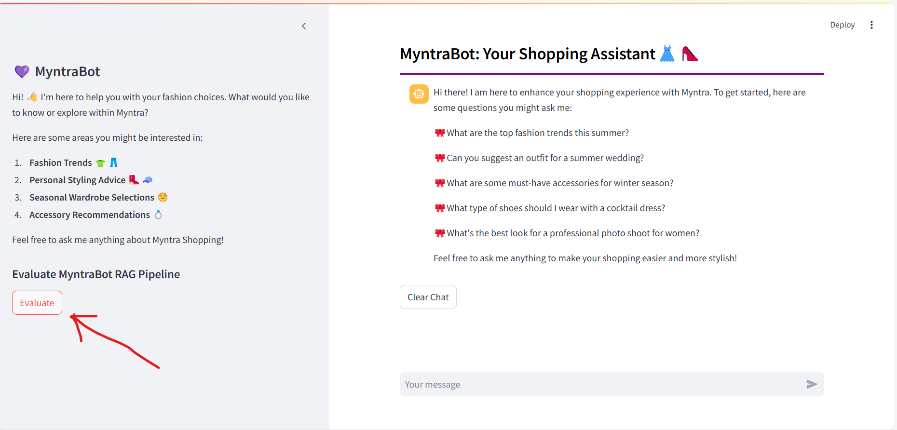
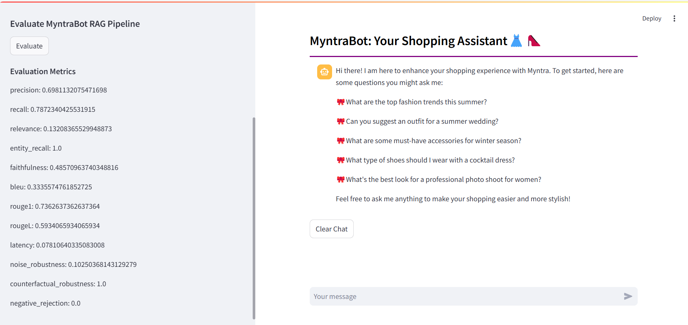

# MyntraBot Metrics Evaluation

This repository contains the code and instructions to evaluate the performance metrics of the RAG-based chatbot, MyntraBot. The evaluation focuses on key metrics such as context precision, recall, relevance, faithfulness, and more. Follow the instructions below to set up and run the evaluation.



------------------------------------
### Youtube Tutorial: https://youtu.be/GGTLaIRUm_k
### Evaluation Report & Document: Evaluation_Report.pdf & Metrics_Evaluation_of_RAG_Chatbot.pdf (available in github repo)
------------------------------------

## Table of Contents

1. [Prerequisites](#prerequisites)
2. [Setup](#setup)
3. [Running the Evaluation](#running-the-evaluation)
4. [Understanding the Code](#understanding-the-code)
5. [Results](#results)


## Prerequisites

Before running the evaluation, ensure you have the following installed:

- Python 3.10
- pip (Python package installer)

## Setup

1. **Clone the Repository**
   
   ```sh
   git clone https://github.com/yourusername/Metrics-Evaluation-of-RAG-Chatbot.git

   cd Metrics-Evaluation-of-RAG-Chatbot
   ```

2. **Create a Virtual Environment and Activate it**
    ```sh
    python -m venv env
    
    myenv\Scripts\activate.bat # On Windows command prompt
    ```
3. **Install Dependencies**
    ```sh 
    pip install -r requirements.txt
    ```
4. **Set your environment variables (API key) in `.env ` file**     
    ```sh
    HUGGINGFACEHUB_API_TOKEN=your_hugging_face_api_token
    ```

## Running the Evaluation
1. **Prepare the Data**
    
    Ensure you have the Myntra product catalog in a CSV file named `myntra_products_catalog.csv`. Place this file in the root directory of the project.

2. **Generate Embeddings**
    
    Run the script to generate embeddings and set up the vector store:
    ```python
    python VectorEmbeddings.py
    ```

3. **Run the MyntraBot for Metrics Evaluation**
    ```streamlit
    streamlit run MyntraBot.py
    ```
4. **Evaluate Metrics**   

    To run evaluation script click `Evaluate` button on the sidebar of the MyntraBot. It will calculate various performance metrics for the chatbot and print the results.

    

## Understanding the Code

### Directory Structure

- `VectorEmbeddings.py`: Generates embeddings for the product catalog and sets up the vector store.
- `MyntraBot.py`: Contains button in the sidebar to evaluate the chatbot performance metrics.
- `evaluation_metrics.py`: Contains the functions to calculate different metrics.
- `requirements.txt`: Lists the dependencies required to run the project.
- `myntra_products_catalog.csv`: Sample product catalog (ensure this file is present in the root directory).

### Key Functions

- **VectorEmbeddings.py**

  This script loads the product catalog, splits the text, generates embeddings using the Hugging Face model, and stores them in a Chroma vector store.

- **MyntraBot.py**

  This script contains the code for RAG pipeline of the MyntraBot and also the button to evaluate the metrics in the sidebar.


- **evaluation_metrics.py**

  Contains functions to calculate precision, recall, relevance, entity recall, noise robustness, faithfulness, BLEU score, ROUGE score, counterfactual robustness, negative rejection, and latency.

## Results

After clicking the `Evaluate` button available on the side bar of the Chatbot screen, the results will be displayed. The metrics provide insights into the chatbot's performance, highlighting areas of strength and opportunities for improvement.


